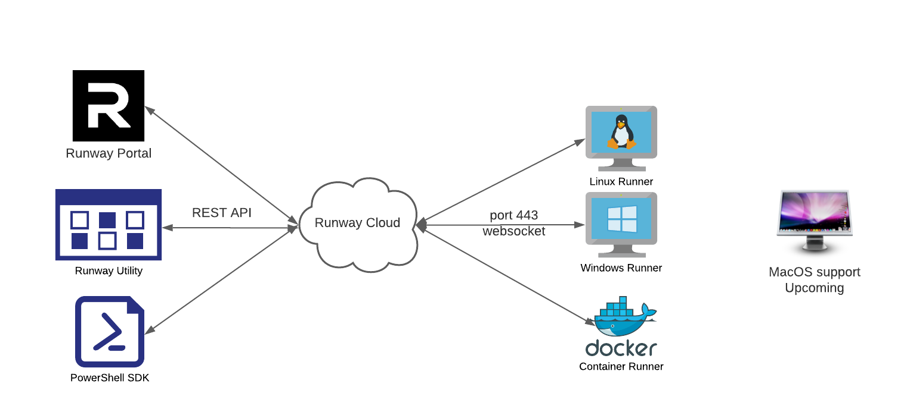
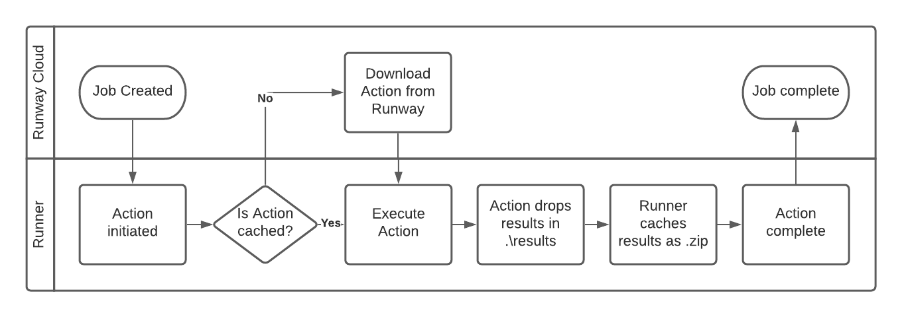
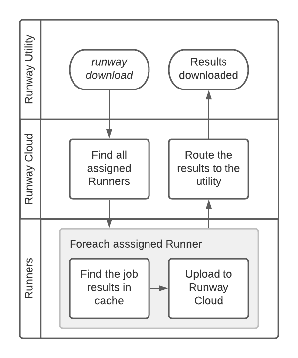
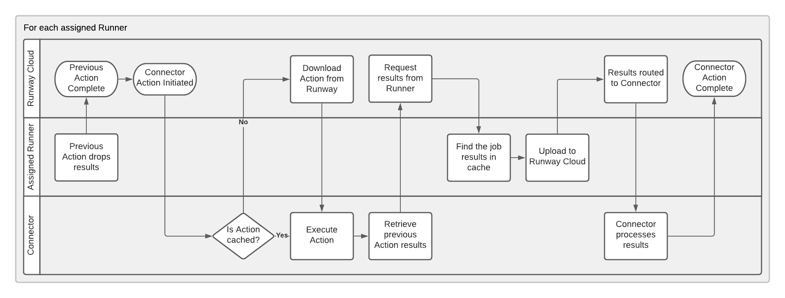

# Research Triangle PowerShell User Group 2022-01-05

## Presentation

Relevant links:
- Runway website: https://runway.host
- Runway Documentation: https://docs.runway.host
- Runway Portal: https://portal.runway.host
- Runway Actions repository: https://github.com/runway-software/actions
- Runway PowerShell SDK:
  - Github: https://github.com/runway-software/runway-powershell
  - PowerShell Gallery: https://www.powershellgallery.com/packages/PsRunway

### What is Runway?

Runway is a service orchestration and automation platform. At its core, it runs arbitrary code (scripts, executables, etc) on endpoints.

Marketing description: Low-Code Automation and Connectivity for Hybrid Cloud Networks.

Runway is:
- An automation platform
- REST API Driven
  - Web based Portal, compiled executable, PowerShell SDK

Runway can:
- Run arbitrary code on endpoints via installed agents (Runners)
  - Including PowerShell! Both Windows PowerShell and PowerShell, even if PowerShell isn't installed
- Orchestrate Jobs
- Securely move data between endpoints, no VPN required
- Run asset discovery on networks
- Self deploy in AD environments



## Enrolling a runner

You can get a token from the Portal.

Or use the SDK:

```powershell
# If you don't already have the utility:
$dls = Get-RwContentPublicDownload
$w64 = $dls | ?{$_.Platform -eq 'Windows64'}
Invoke-RwContentDownloadPublicFile -Id $w64.Id -OutFile .\runway.exe

# Get a token, associate it to a specific group
# Runway will default to your root group
$group = (Get-RwGroup).Items | ?{$_.Name -eq 'Home'}
$tokenSplat = @{
    Expiration = (Get-Date).AddHours(1)
    IsOneTime = $true
    GroupId = $group.Id
    Type = 'EnrollPersistentRunner'
}
$token = New-RwEnrollmentSession @tokenSplat

# Use the utility to install the Runner:
.\runway install -t $token.Token
```

## Running a job

*Create a Job in the Portal.*

*Note difference between a 'Job' and an 'Action'.*

*Run the Job.*



## Manually Retrieving results

*Manually download results.*



## How Runway handles results

Results are any files that are created by the Action and dropped in .\results.

The Runner zips up the .\results file and caches it for the life of the job.

## Connectors

Connectors are Actions that run on a dedicated Runner and run once for each Runner assigned the job.

They are designed to do something with the Job's results.

*Create Job with download:file connector*

*Show the downloaded results*



## Custom Actions

*Show the code for inventory:software*

## Custom Connectors

*Show the code for download:file*

## SDK

## Upcoming features

- MacOS support
- Remote console