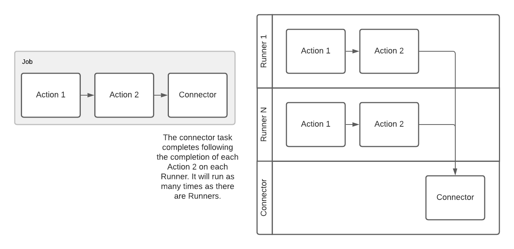

# Research Triangle PowerShell User Group 2022-01-05

## Disclaimer

I work for Runway and I am not a salesperson.

After getting a couple of demos of Runway, I asked if they were hiring because I thought it was so cool. So I ended up joining as a System Engineer, which means that I build actions, make recommendations to the dev team about features, I work with users to make them successful, and I do demos for folks that I think would like Runway. So here I am.

## Marketing Spiel

Runway is a new startup. The platform has been developed over the past 2 years led by a developer that has built other platforms from scratch. We haven't officially launched yet as we are still in stealth mode, but that just means that we aren't doing any big time marketing. There are no restrictions around discussing and sharing about Runway.

We are new to dealing with users of our platform, so we would love to hear any and all feedback from PowerShell folks so that we can make Runway an effective tool for your toolbox.

Runway has and will always have a free community version that is limited by endpoint count. Currently the limit is 1000.

## Presentation

Relevant links:
- Runway website: https://runway.host
- Runway Documentation: https://docs.runway.host
- Runway Portal: https://portal.runway.host
- Runway Actions repository: https://github.com/runway-software/actions
- Runway PowerShell SDK:
  - Github: https://github.com/runway-software/runway-powershell
  - PowerShell Gallery: https://www.powershellgallery.com/packages/PsRunway

### What is Runway?

Runway is a service orchestration and automation platform. At its core, it runs arbitrary code (scripts, executables, etc) on endpoints.

Marketing description: Low-Code Automation and Connectivity for Hybrid Cloud Networks.

Runway is:
- An automation platform
- REST API Driven
  - Web based Portal, compiled executable, PowerShell SDK

Runway can:
- Run arbitrary code on endpoints via installed agents (Runners)
  - Including PowerShell! Both Windows PowerShell and PowerShell, even if PowerShell isn't installed
- Orchestrate Jobs
- Securely move data between endpoints, no VPN required
- Run asset discovery on networks
- Self deploy in AD environments


## Enrolling a runner

*Get a token from the Portal.*

*Show Groups.*

Or use the SDK:

```powershell
# If you haven't already authenticated
$s = Invoke-RwLoginAuthentication -Email <email> -Password <password> -Remember
$env:RunwaySessionToken = $s.Session

# If you don't already have the utility:
$dls = Get-RwContentPublicDownload
$w64 = $dls | ?{$_.Platform -eq 'Windows64'}
Invoke-RwContentDownloadPublicFile -Id $w64.Id -OutFile .\runway.exe

# Get a token, associate it to a specific group
# Runway will default to your root group
$group = (Get-RwGroup).Items | ?{$_.Name -eq 'Home'}
$tokenSplat = @{
    Expiration = (Get-Date).AddHours(1)
    IsOneTime = $true
    GroupId = $group.Id
    Type = 'EnrollPersistentRunner'
}
$token = New-RwEnrollmentSession @tokenSplat

# Use the utility to install the Runner:
.\runway install -t $token.Token
```

## Running a job

*Create a Job in the Portal.*

*Note difference between a 'Job' and an 'Action'.*

*Run the Job.*

Here's the process that happens with a single Action job:


## A note about results

Results are whatever the Action wants them to be. Technically they are any files that are placed in .\results when the Action executes.

Runway does not store Action results, they are zipped and cached on the Runner.

Results can be routed with a Connector.

## Manually Retrieving results

*Manually download results.*


## Connectors

Connectors are Actions that run on a dedicated Runner and run once for each Runner assigned the job.

They are designed to do something with the Job's results.

*Create Job with download:file connector*

Here is what happens:


More details about how results are handled in Runway:


When a Job is assigned to multiple Runners, they each execute independently:



*Show the downloaded results*

## Custom Actions

*Show the code for inventory:software*

*Demonstrate the deployment process in the [Actions repository](https://github.com/Runway-Software/actions)*

## Custom Connectors

*Show the code for download:file*

## SDK

To demonstrate the SDK, I'll use my [Sample Scheduled Tasks repository](https://github.com/Runway-Software/sample-scheduled-tasks).

The idea with this repository is twofold:

1. Demonstrate how Runway can be used to replace the Task Scheduler in Windows.
2. Demonstrate how Jobs and Actions can be stored in Git and synced to Runway using the PowerShell SDK.

## Upcoming features

- MacOS support
- Remote console